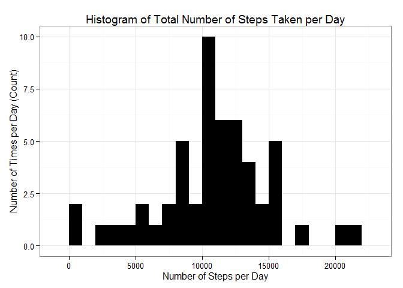
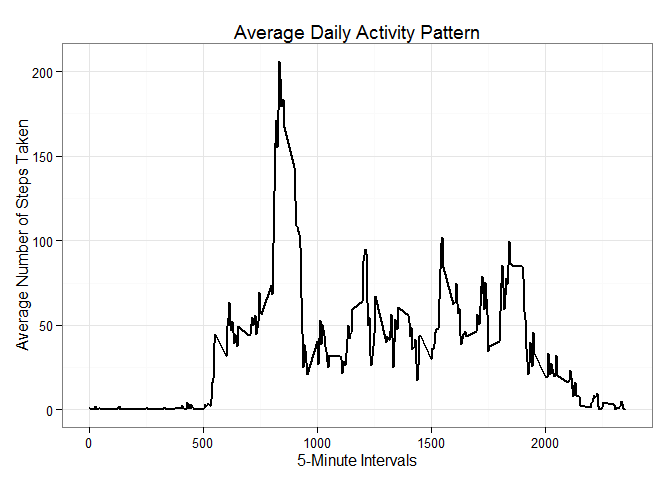
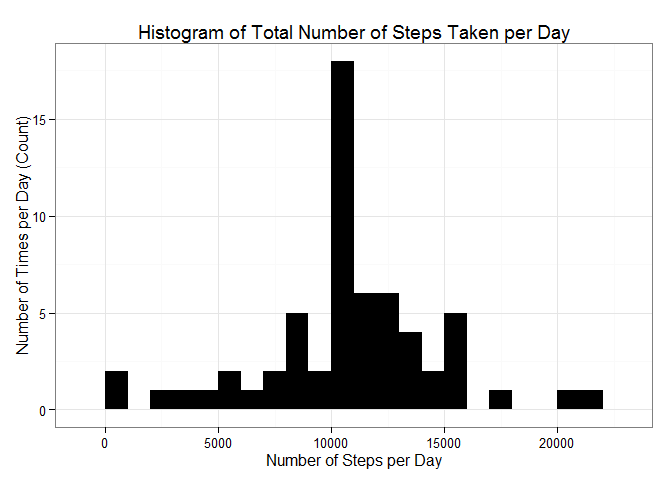
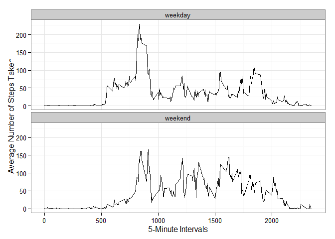

Reproducible Research - Peer Assessment 1
=========================================

(June 2015)

### Load required libraries

    library(knitr)
    library(ggplot2)

### Preparing the R environment

    # Set global options

    opts_chunk$set(echo=TRUE)

### Loading and pre-processing the data

    # Read dataset and load data in R

    dataset <- read.csv("activity.csv")

    # Convert the date field to Date class

    dataset$date <- as.Date(dataset$date, format = "%Y-%m-%d")

    # Convert the interval field to Factor class

    dataset$interval <- as.factor(dataset$interval)

    # Check the dataset structure

    str(dataset)

    ## 'data.frame':    17568 obs. of  3 variables:
    ##  $ steps   : int  NA NA NA NA NA NA NA NA NA NA ...
    ##  $ date    : Date, format: "2012-10-01" "2012-10-01" ...
    ##  $ interval: Factor w/ 288 levels "0","5","10","15",..: 1 2 3 4 5 6 7 8 9 10 ...

### What is mean total number of steps taken per day?

Calculate the total number of steps taken per day.

    total.steps <- aggregate(steps ~ date, dataset, sum) 
    colnames(total.steps) <- c("date","steps") 
    head(total.steps)

    ##         date steps
    ## 1 2012-10-02   126
    ## 2 2012-10-03 11352
    ## 3 2012-10-04 12116
    ## 4 2012-10-05 13294
    ## 5 2012-10-06 15420
    ## 6 2012-10-07 11015

Make a histogram of the total number of steps taken each day.

    ggplot(total.steps, aes(x = steps)) + geom_histogram(fill = "black", binwidth = 1000) + labs(title ="Histogram of Total Number of Steps Taken per Day", x = "Number of Steps per Day", y = "Number of Times per Day (Count)") + theme_bw()

Calculate and report the mean and median of the total number of steps
taken per day.

    steps_mean <- mean(total.steps$steps, na.rm=TRUE)
    steps_mean

    ## [1] 10766.19

    steps_median <- median(total.steps$steps, na.rm=TRUE)
    steps_median

    ## [1] 10765

### What is the average daily activity pattern?

Make a time series plot (i.e. type = "l") of the 5-minute interval
(x-axis) and the average number of steps taken, averaged across all days
(y-axis).

    # Firstly, calculate the aggregation of steps by 5-minute intervals into a data frame.

    steps.interval <- aggregate(dataset$steps, by = list(interval = dataset$interval), FUN=mean, na.rm=TRUE)

    # Then convert to integers

    steps.interval$interval <- as.integer(levels(steps.interval$interval)[steps.interval$interval])
    colnames(steps.interval) <- c("interval", "steps")

    # Lastly, plot the time series of the average number of steps taken (averaged across all days) versus the 5-minute intervals.

    ggplot(steps.interval, aes(x=interval, y=steps)) + geom_line(color="black", size=1) + labs(title="Average Daily Activity Pattern", x="5-Minute Intervals", y="Average Number of Steps Taken") + theme_bw()

Which 5-minute interval, on average across all the days in the dataset,
contains the maximum number of steps?

    max.interval <- steps.interval[which.max(steps.interval$steps),]
    max.interval

    ##     interval    steps
    ## 104      835 206.1698

### Imputing missing values

Calculate and report the total number of missing values in the dataset
(i.e. the total number of rows with NAs)

    missing.values <- sum(is.na(dataset$steps))
    missing.values

    ## [1] 2304

Devise a strategy for filling in all of the missing values in the
dataset.

    # Replace each missing value with the mean value of its 5-minute interval.

    na_fill <- function(dataset, pervalue) {
            na_index <- which(is.na(dataset$steps))
            na_replace <- unlist(lapply(na_index, FUN=function(idx){
                    interval = dataset[idx,]$interval
                    pervalue[pervalue$interval == interval,]$steps
            }))
            fill_steps <- dataset$steps
            fill_steps[na_index] <- na_replace
            fill_steps
    }

    dataset_fill <- data.frame(  
            steps = na_fill(dataset, steps.interval),  
            date = dataset$date,  
            interval = dataset$interval)
    str(dataset_fill)

    ## 'data.frame':    17568 obs. of  3 variables:
    ##  $ steps   : num  1.717 0.3396 0.1321 0.1509 0.0755 ...
    ##  $ date    : Date, format: "2012-10-01" "2012-10-01" ...
    ##  $ interval: Factor w/ 288 levels "0","5","10","15",..: 1 2 3 4 5 6 7 8 9 10 ...

Create a new dataset that is equal to the original dataset but with the
missing data filled in.

    head(dataset_fill)

    ##       steps       date interval
    ## 1 1.7169811 2012-10-01        0
    ## 2 0.3396226 2012-10-01        5
    ## 3 0.1320755 2012-10-01       10
    ## 4 0.1509434 2012-10-01       15
    ## 5 0.0754717 2012-10-01       20
    ## 6 2.0943396 2012-10-01       25

    sum(is.na(dataset_fill))

    ## [1] 0

    # The above new dataset and the proof shows all the missing values been filled in the mean value for that 5-minute interval, whereas the original dataset and the proof below shows the existing missing values, NA.

    head(dataset)

    ##   steps       date interval
    ## 1    NA 2012-10-01        0
    ## 2    NA 2012-10-01        5
    ## 3    NA 2012-10-01       10
    ## 4    NA 2012-10-01       15
    ## 5    NA 2012-10-01       20
    ## 6    NA 2012-10-01       25

    sum(is.na(dataset))

    ## [1] 2304

Make a histogram of the total number of steps taken each day and
Calculate and report the mean and median total number of steps taken per
day. Do these values differ from the estimates from the first part of
the assignment? What is the impact of imputing missing data on the
estimates of the total daily number of steps?

    total.steps <- aggregate(steps ~ date, dataset_fill, sum) 
    colnames(total.steps) <- c("date","steps") 
    head(total.steps)

    ##         date    steps
    ## 1 2012-10-01 10766.19
    ## 2 2012-10-02   126.00
    ## 3 2012-10-03 11352.00
    ## 4 2012-10-04 12116.00
    ## 5 2012-10-05 13294.00
    ## 6 2012-10-06 15420.00

    # Plotting the histogram with imputed missing values.

    ggplot(total.steps, aes(x = steps)) + geom_histogram (fill = "black", binwidth = 1000) + labs(title ="Histogram of Total Number of Steps Taken per Day", x = "Number of Steps per Day", y = "Number of Times per Day (Count)") + theme_bw()

    # Calculating the mean total number of steps taken per day.

    Steps_meanfill <- mean(total.steps$steps, na.rm=TRUE)
    Steps_meanfill

    ## [1] 10766.19

    # Calculating the median total number of steps taken per day.

    Steps_medianfill <- median(total.steps$steps, na.rm=TRUE)
    Steps_medianfill

    ## [1] 10766.19

    # These values do not differ much from the estimates from the first part of the assignment, thus minimal difference.

    # Imputing missing data on the estimates of the total daily number of steps does not impact the mean figure but only slightly increases the median figure.

### Are there differences in activity patterns between weekdays and weekends?

Create a new factor variable in the dataset with two levels - "weekday"
and "weekend" indicating whether a given date is a weekday or weekend
day.

    # Using the dataset with filled-in missing values, a new factor variable is created with two levels - weekday and weekend - the steps are:

    1. Add a new column to indicate the day of the week
    2. Subset the table into two parts - weekends (Saturday and Sunday) and weekdays (Monday through Friday).
    3. Tabulate the average steps per interval for each data set.
    4. Plot the two data sets side by side for comparison.

    weekdays_steps <- function(dataset) {
        weekdays_steps <- aggregate(dataset$steps, by=list(interval = dataset$interval),
                              FUN=mean, na.rm=T)

    # convert to integers for plotting

        weekdays_steps$interval <- 
                as.integer(levels(weekdays_steps$interval)[weekdays_steps$interval])
        colnames(weekdays_steps) <- c("interval", "steps")
        weekdays_steps
    }

    dataset_by_weekdays <- function(dataset) {
        dataset$weekday <- 
                as.factor(weekdays(dataset$date)) # weekdays
        weekend_dataset <- subset(dataset, weekday %in% c("Saturday","Sunday"))
        weekday_dataset <- subset(dataset, !weekday %in% c("Saturday","Sunday"))

        weekend_steps <- weekdays_steps(weekend_dataset)
        weekday_steps <- weekdays_steps(weekday_dataset)

        weekend_steps$dayofweek <- rep("weekend", nrow(weekend_steps))
        weekday_steps$dayofweek <- rep("weekday", nrow(weekday_steps))

        dataset_by_weekdays <- rbind(weekend_steps, weekday_steps)
        dataset_by_weekdays$dayofweek <- as.factor(dataset_by_weekdays$dayofweek)
        dataset_by_weekdays
    }
    dataset_weekdays <- dataset_by_weekdays(dataset_fill)

Make a panel plot containing a time series plot (i.e. type = "l") of the
5-minute interval (x-axis) and the average number of steps taken,
averaged across all weekday days or weekend days (y-axis).

    ggplot(dataset_weekdays, aes(x=interval, y=steps)) + geom_line(color="black") + facet_wrap(~ dayofweek, nrow=2, ncol=1) + labs(x="5-Minute Intervals", y="Average Number of Steps Taken") + theme_bw()

